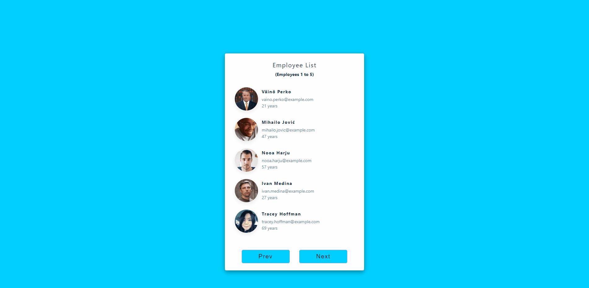
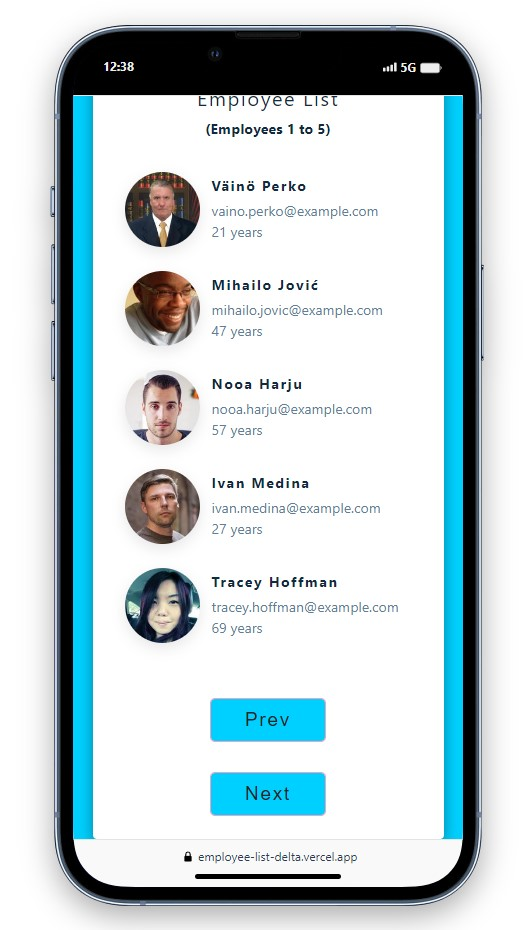
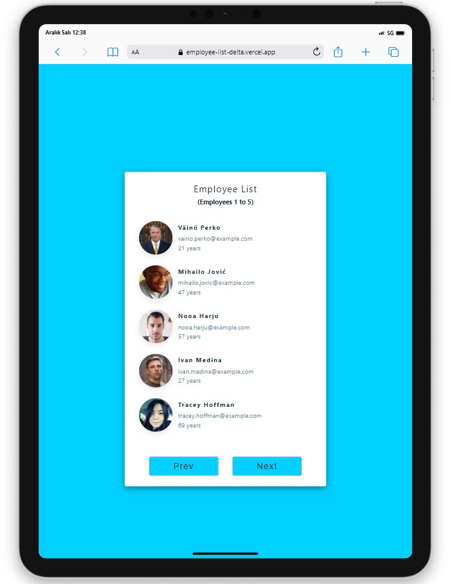
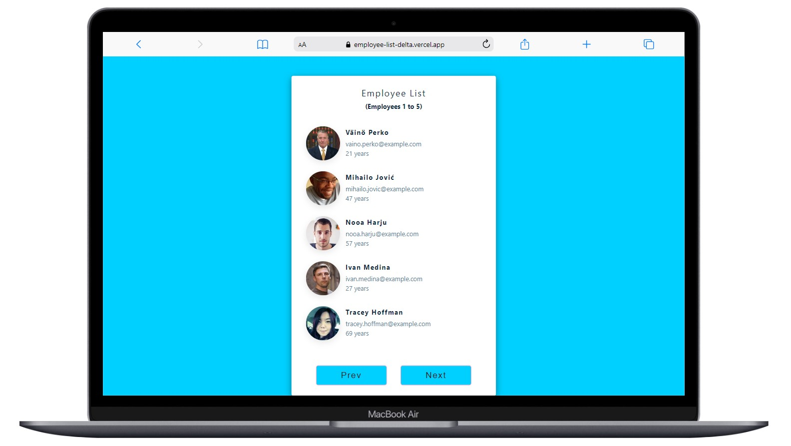

# Employee List Project

<div align="center">
  
</div>

## About the Project

This project is a simple web application for managing the information of employees in a company.

## Live Project Link

You can access the live version of the project [here](https://employee-list-delta.vercel.app/).

```
Employee List (folder)
|
|----readme.md       
SOLUTION
├── public
│     └── index.html
├── src
│    ┣ 📂assets
│    ┣ 📂components
│    ┃    ┗ 📜List.js
│    ┣ 📂helper
│    ┃    ┗ 📜data.js
│    ┣ 📂scss
│    ┃    ┣ 📜_mixins.scss
│    ┃    ┣ 📜_reset.scss
│    ┃    ┗ 📜_variables.scss
│    ┣ 📜App.js
│    ┣ 📜index.js
│    ┗ 📜index.scss
├── package.json
└── yarn.lock

```

## Screenshots

<div align="center">
  
  
  
</div>

## Compatibility

The project is compatible with both wide-screen computers and mobile devices.